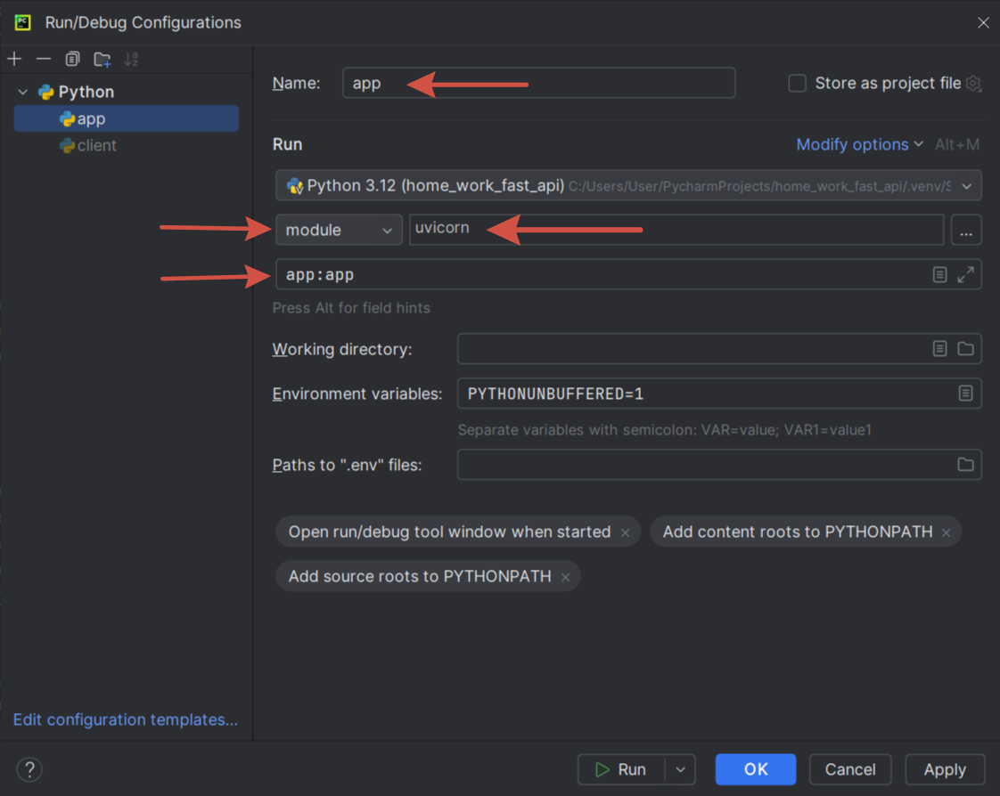
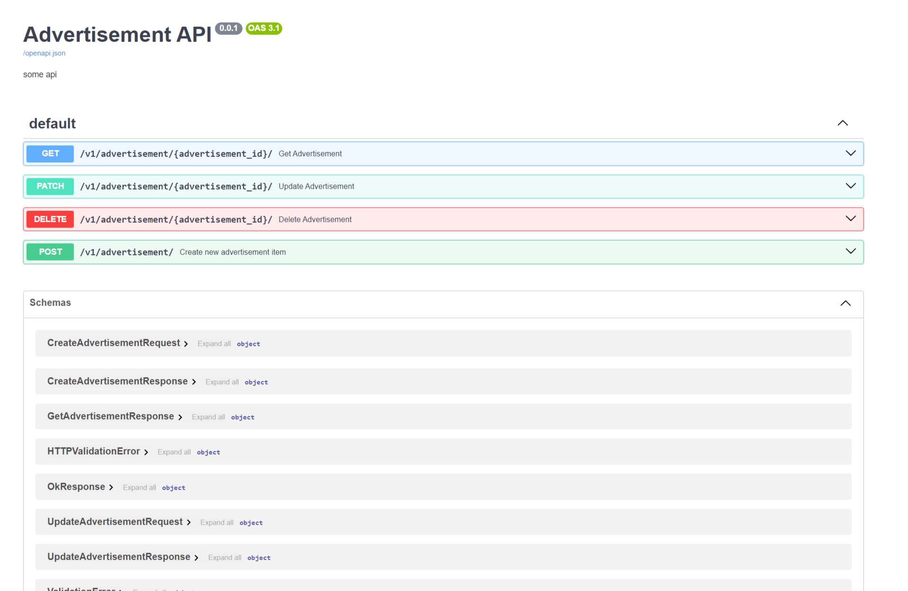

# Домашнее задание "Создание REST API на FastApi"

## `Порядок работы`

1. Запускаем Docker Desktop. В терминале выполняем команду

>   `docker-compose up --build`

создается контейнер с базой данных и приложением 

2. Настраиваем запуск приложения и запускаем его

3. Открываем файл [client.py](client.py)
Используем закомментированный код сперва для создания объявления (объявлений).
Далее можно вывести данные об объявлении по `id` или по `автору`, изменить название, текст, стоимость и автора,
а так же удалить объявление. Для этого необходимо раскомментировать нужные команды и запустить файл.
4. Те же операции можно выполнить в браузере по адресу http://localhost:8000/docs#/
5. Те же операции можно выполнить в браузере по адресу http://localhost:8080/docs#/. Этот порт мы записали
для Docker-контейнера. В этом случае мы работаем с приложением, запущенным в Docker-контейнере. 
Запускать приложение в IDE не требуется.

# Домашнее задание к лекции «Создание REST API на FastApi» часть 1

Инструкцию по сдаче домашнего задания Вы найдете на главной странице репозитория.

# Задание 
Вам нужно написать на fastapi и докеризировать сервис объявлений купли/продажи.

У объявлений должны быть следующие поля:
 - заголовок
 - описание
 - цена
 - автор
 - дата создания

Должны быть реализованы следующе методы:
 - Создание: `POST /advertisement`
 - Обновление: `PATCH /advertisement/{advertisement_id}`
 - Удаление: `DELETE /advertisement/{advertisement_id}`
 - Получение по id: `GET  /advertisement/{advertisement_id}`
 - Поиск по полям: `GET /advertisement?{query_string}`